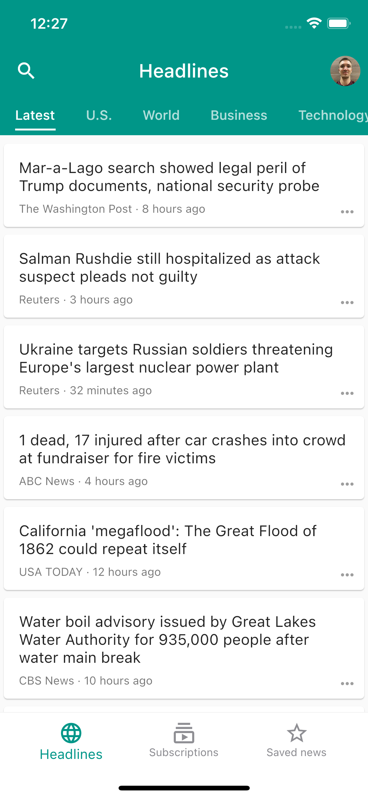
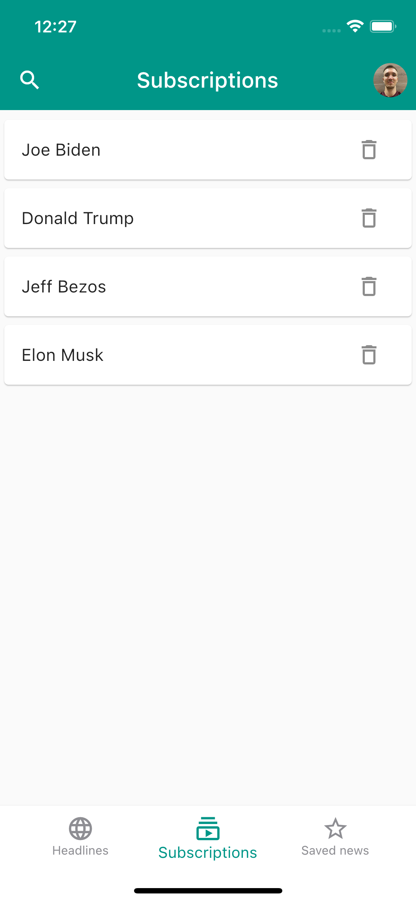
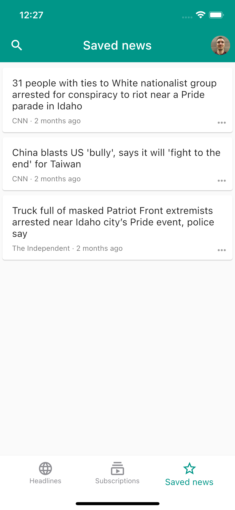
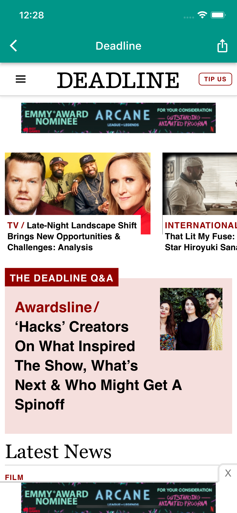
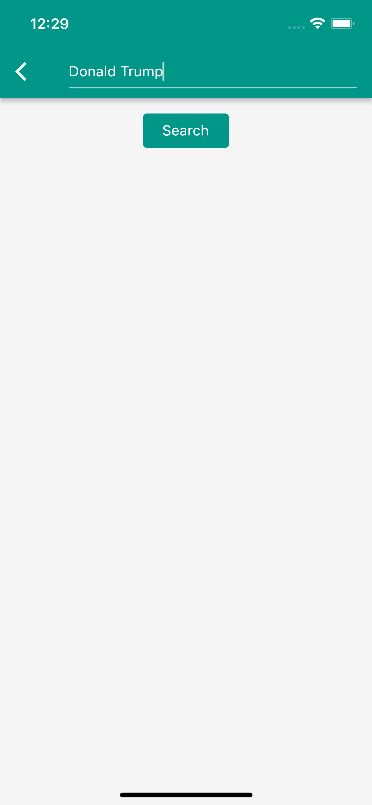
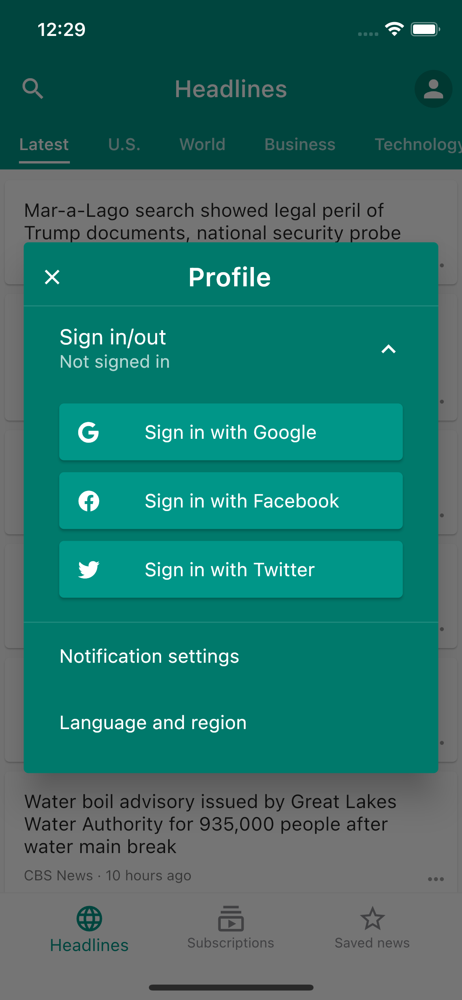
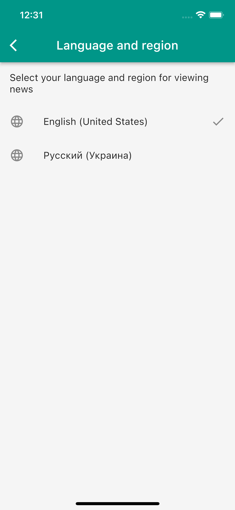

# News app

This app was created in my free time for training purposes. It has the following features:

- News are fetched from *Google News RSS Feed*.
- The app is currently supported on **3 platforms**: *iOS*, *Android* and *Web*.
- **Riverpod** is used as the main state management solution.
- **Firestore** database is used for storing user data. 
- Advanced **authentication** with multiple accounts is available. Authentication functionality is moved to a *separate package* for reusability.
- The app is fully **tested** with unit, widget and integration tests. Integration tests run on all supported platforms.
- The app is fully **documented**, so it's easier to read through the code.
- The app is **localized** for English and Russian languages, with correct locale being determined based on system settings. You can also change the language of the news you get in app settings.
- Advanced **routing** is implemented with *go_router* package, to allow for better navigation on the web via the address bar and support precise externally shared app links.
- **State restoration** support is added. It lets you return to the exact state you left the app in before it was terminated by the OS for inactivity (to save energy/memory).
- The app has a good **structure** with several modules.
- The app can be built with **2 flavors**: development and production. Each of them uses a different firebase project, app name and icon.
- Slightly different app **layouts** are available based on the screen size.

 

  
   
   
   
   
   
   
   
   

